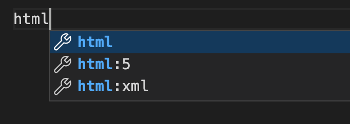

# Intro to HTML

HTML, which stands for HyperText Markup Language, is the standard markup language used for creating web pages and applications. It provides the structure and content of a webpage, allowing you to define the elements and their relationships.

HTML is based on a system of tags, which are enclosed in angle brackets (< >) and provide instructions to the web browser on how to display the content. Tags are typically used in pairs, with an opening tag and a closing tag, surrounding the content they affect.

Here's a basic example of HTML code:

```html
<!DOCTYPE html>
<html lang="en">
  <head>
    <title>My First Webpage</title>
  </head>
  <body>
    <h1>Welcome to My Webpage</h1>
    <p>This is a paragraph of text.</p>
    
  </body>
</html>
```

In the above example, we have the following HTML elements:

- `<!DOCTYPE html>` This declaration specifies the HTML version being used, which is HTML5 in this case.
- `<html lang="en">` The root element of an HTML document.
- `<head>` This section contains metadata and other non-visible elements for the webpage, such as the title of the page.
- `<title>`  The title of the webpage, displayed in the browser's title bar or tab.
- `<body>` The container for the visible content of the webpage.
- `<h1>` A heading element, denoting the main heading of the page.
- `<p>` A paragraph element, used to enclose and display a block of text.
- `` An image element, used to display an image on the webpage.

## Automatic formatting on VS Code

The format of the code in an HTML document is very important. In order to make it easier, let's install a VS Code extension called Prettier. Follow the instructions in this document:

https://www.educative.io/answers/how-to-set-up-prettier-and-automatic-formatting-on-vs-code


## Basic HTML document

Create a folder called `html_and_css` and touch a new file called `index.html` (`index` is the conventional name for the main web page of a website)

Open the `index.html` in VS Code and start typing `HTML`. Notice the suggestions that VS Code provides and select the `html:5` option.



```html
<!DOCTYPE html>
<html lang="en">
  <head>
    <meta charset="UTF-8" />
    <meta http-equiv="X-UA-Compatible" content="IE=edge" />
    <meta name="viewport" content="width=device-width, initial-scale=1.0" />
    <title>Document</title>
  </head>
  <body></body>
</html>
```

Save your document and make sure that Prettier formats it correctly. 

Inside the `<body>` tag is where we will write all our HTML tags. The `<body>` is the main content that the browser will display. 

## Comments 

HTML comments are formatted like this:

```html
<!-- This is a comment! -->
```

In the next lesson, we'll look at some of the most used HTML tags and how to use them.

[Next lesson >>](./2_html_elements.md)

### Resources for investigating HTML 

- [MDN Docs](https://developer.mozilla.org/en-US/docs/Learn/HTML)
- [W3schools](https://www.w3schools.com/html/default.asp)