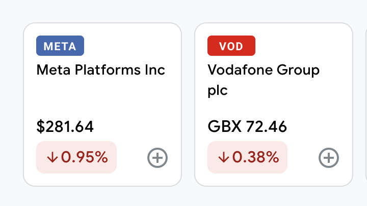
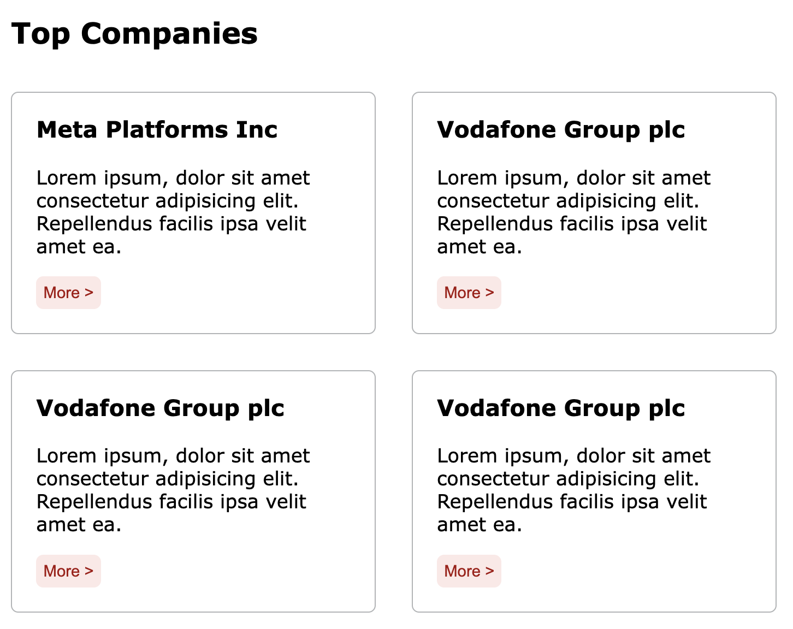

# Grid of Cards

A "card" is a common way to display a group of information that is duplicated many times. 

For example, from Google Finance, two cards are displayed here:



The layout of the two cards is identical, it's just the data that varies.

A common way to layout lots of cards is in a grid. Let's attempt something in the same vein.

This is what we're aiming for:




## HTML

```html
<!-- index.html -->

<!DOCTYPE html>
<html lang="en">
  <head>
    <meta charset="UTF-8" />
    <meta http-equiv="X-UA-Compatible" content="IE=edge" />
    <meta name="viewport" content="width=device-width, initial-scale=1.0" />
    <title>Grid of Cards</title>
    <link rel="stylesheet" href="style.css" />
  </head>
  <body>
    <section>
      <h2>Top Companies</h2>
      <div class="top-companies">
        <div class="card">
          <h3>Meta Platforms Inc</h3>
          <p>
            Lorem ipsum, dolor sit amet consectetur adipisicing elit.
            Repellendus facilis ipsa velit amet ea.
          </p>
          <button>More ></button>
        </div>
        <div class="card">
          <h3>Vodafone Group plc</h3>
          <p>
            Lorem ipsum, dolor sit amet consectetur adipisicing elit.
            Repellendus facilis ipsa velit amet ea.
          </p>
          <button>More ></button>
        </div>
        <div class="card">
          <h3>Vodafone Group plc</h3>
          <p>
            Lorem ipsum, dolor sit amet consectetur adipisicing elit.
            Repellendus facilis ipsa velit amet ea.
          </p>
          <button>More ></button>
        </div>
        <div class="card">
          <h3>Vodafone Group plc</h3>
          <p>
            Lorem ipsum, dolor sit amet consectetur adipisicing elit.
            Repellendus facilis ipsa velit amet ea.
          </p>
          <button>More ></button>
        </div>
        <div class="card">
          <h3>Vodafone Group plc</h3>
          <p>
            Lorem ipsum, dolor sit amet consectetur adipisicing elit.
            Repellendus facilis ipsa velit amet ea.
          </p>
          <button>More ></button>
        </div>
        <div class="card">
          <h3>Vodafone Group plc</h3>
          <p>
            Lorem ipsum, dolor sit amet consectetur adipisicing elit.
            Repellendus facilis ipsa velit amet ea.
          </p>
          <button>More ></button>
        </div>
      </div>
    </section>
  </body>
</html>
```

## CSS

```css
/* style.css */

body{
    font-family: Verdana, Geneva, Tahoma, sans-serif, arial;
}

section {
    /* The first padding applies to the top, the second to the right and left, the third to the bottom */
    padding: 30px 30px 50px;
    width: 50%;
    /* This will centre the section horizontally. 0 margin north and south and automatic for east and west */
    margin: 0 auto;
}

.top-companies {
    /* A flex container for the cards */
    display: flex;
    /* Make sure the cards wrap onto the next line if the window gets smaller */
    flex-wrap: wrap;
}

.card {
    /* Specifies how much of the remaining space in the flex container should be assigned to the item */
    /* https://www.joshwcomeau.com/css/interactive-guide-to-flexbox/#flex-grow-8 */
    flex-grow: 1;
    /* Set a reasonable width. Play around with this and see the effect on the layout */
    width: 30%;
    /* Shorthand for all directions of padding. In the order top, right, bottom, left */
    padding: 0px 20px 20px 20px;
    border: 1px solid #b1b4b6;
    /* Rounded corners */
    border-radius: 6px;
    /* The first value is top and bottom, the second value is right and left */
    margin: 15px 15px;
}

button {
    border: none;
    padding: 6px;
    border-radius: 6px;
    background: rgb(252,232,230);
    color: rgb(165,14,14);
}

button:hover{
    cursor: pointer;
}

```


