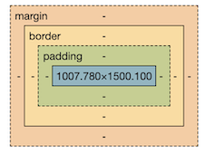

# CSS Box Model

This is a critical part of the CSS rendering model. There are four elements to the box model.

1. Content
2. Padding
3. Border
4. Margin

Open your DevTools in Chrome and located the "Styles" tab. Scroll down to the bottom and you'll see a diagram like this:



What does it mean when we say an element has a width of 100%? Consider the following:

## Padding

For padding and margin, values are entered in a clockwise way from north.

```css
.card {
  /* the values are in the order north, east, south, west */
  padding: 10px 20px 5px 3px;
}
```

The top will have padding 10, the right will be 20, the bottom 5 and the left 3.

In the next example, all sides will have padding 20px;

```css
.card {
  padding: 20px;
}
```

You can over-write a side with a more specific property.

```css
.card{
  padding: 20px;
  padding-left: 10px;
}
```
The left side will have padding 10 while all others will be 20. Note: The more specific
padding-left hast to come AFTER the padding.

## Border

There are three styles specific to border:

- Border width (eg. 3px, 1em)
- Border style (eg. solid, dotted)
- Border color (eg. dodgerblue, black)

Usually, they are used in the shorthand style:

```css
.card {
  border: 1px solid black;
}
```

For rounded corners:

```css
.card {
  border: 1px solid black;
  border-radius: 5px;
}
```

## Margin

For padding and margin, values are entered in a clockwise way from north.

One quick and easy way to center an element is to use `margin: auto`. Note, the element must have a width. In this case, 50%. Note, this only works with width and not height.  

```css
.content {
  width: 50%;
  margin-left: auto;
  margin-right: auto;
}

```

### Negative Margin

... can be really useful. Margin is not exclusively about changing the selected element's position. It's about changing the gap between elements.

Negative margin can affect the position of all siblings.

An example would be having a heading 'pop up' a little bit from it's article. A full width image in a paragraph of text can also be achieved with negative margin. (images are like foreign objects being imported into the document so we have to wrap them in a div usually to make applying margin negative more useful)


### Further resources

[MDN Box Model](https://developer.mozilla.org/en-US/docs/Web/CSS/CSS_box_model/Introduction_to_the_CSS_box_model)

# Next Lesson
[CSS Layout >>](./9_css_layout.md)
