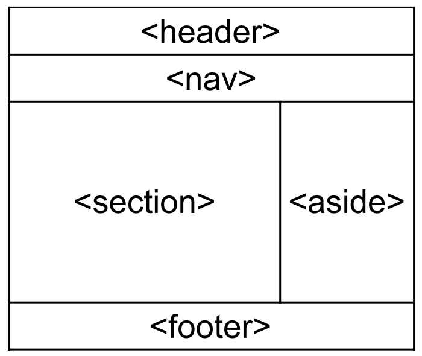
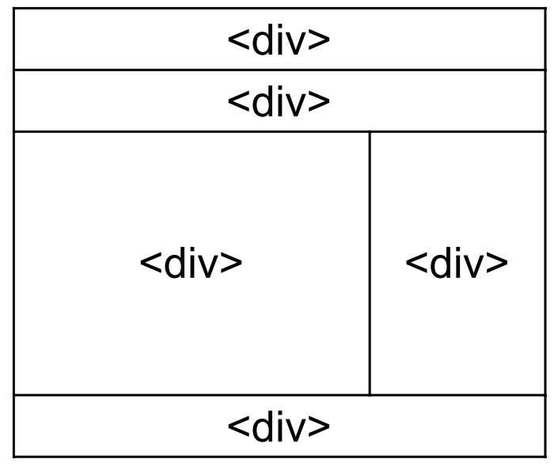

# Semantic HTML

Some HTML tags tell us nothing about what is contained within them, most notably `<div>`. It's very easy to overuse these because they feel very general purpose. Certainly, we will use them a lot, but our preference should always be to use semantic HTML.

Let's take a look at two ways of doing the same thing and see which is better: 

### Non-semantic HTML
```html
<div id="header">
  <h1>
    Welcome to my website!
  </h1>
</div>
```

### Semantic HTML
```html
<header>
  <h1>
     Welcome to my website!
  </h1>
</header>
```

Functionally, both do the same job: they display a title. However, we should always prefer the semantic approach. This is because it has some built in styling should our CSS fall through, it makes search engines understand the content of our pages and index them accurately, and most importantly they are crucial for people using screen readers and other accessibility tools. 

Here are some semantic html tags that we can use to be as syntactically appropriate as possible:

``` html
<article>
<aside>
<details>
<footer>
<header>
<main>
<nav>
<section>
<summary>
```

For example, our website could be made up of tags like so:



And this would tell us much more about the structure of the page than a website that contained its information like so:



### Further resources

- [Semantic HTML and accessibility](https://developer.mozilla.org/en-US/docs/Learn/Accessibility/HTML)
- [Practical semantic HTML guide](https://uxdesign.cc/semantic-html-the-foundation-of-web-accessibility-e5bbecad7c17)
- [Explanation of some semantic HTML tags](https://www.w3schools.com/html/html5_semantic_elements.asp)

# Next Lesson
[HTML Quiz >>](./6_html_quiz.md)